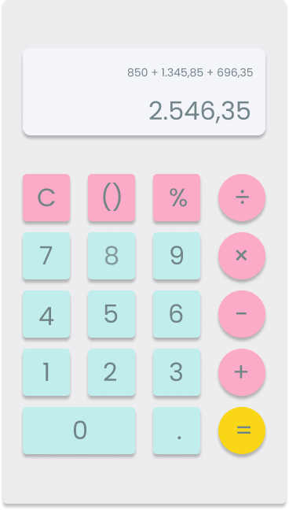

# Descrição 📜
Este projeto tem como objetivo desenvolver um protótipo visual de uma calculadora utilizando ferramentas de design como **Figma** ou **Adobe XD**.

## Especificações 📏
* Tamanho da tela: 360x640 pixels;
* O protótipo inclui todos os elementos da interface, como botões numéricos, operações matemáticas e um visor para exibir o resultado;
* Deve conter uma paleta de cores, tipografia e um layout bem definido;
* A interface deve conter:
    * Um visor para exibir os números digitados e o resultado das operações;
    * Botões de 0 a 9;
    * Botões para as operações matemáticas; adição (+), subtração (-), multiplicação (x) e divisão (÷).
    * Um botão de igual (=);
    * Uma botão para limpar o visor (C ou AC).

## Mais informações 🔗

### Captura de Tela 📸

#### Paleta, Tipografia, Layout dos Elementos
* Cores: 
    * #FBAAC7 para as operações; 
    * #C1EEED para os números; 
    * #FAD716 para botão de igualdade; 
    * #F4F4FB para o visor;
    * #EDEDF0 para o frame;
    * #718586 para o texto.
* Tipografia
    * Poppins.
* Layout dos Elementos
    * Todos os botões têm o tamanho de 60x60 pixels.
    * As três primeiras colunas são quadrados com 5px de border-radius;
    * A última coluna possui botões arredondados;

### Link do Protótipo 🔗

[**Clique aqui para acessar (requer cadastro no FIGMA)**](https://www.figma.com/design/PGJNljyxOjNhpAyRLvDwYZ/calculator?node-id=0-1&t=ErHzGWuoRMKWTwTd-1)