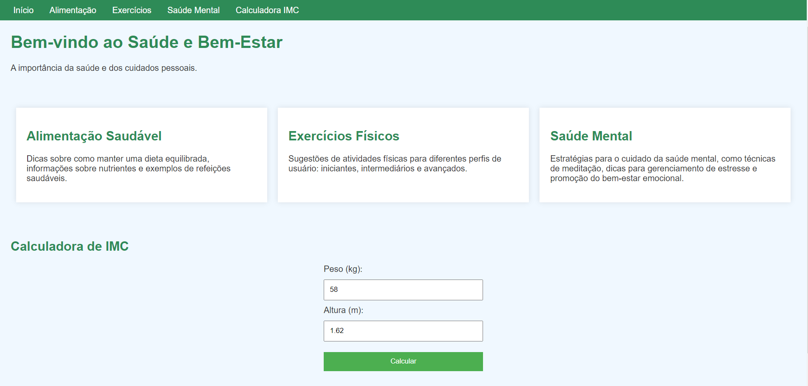

# Projeto: Saúde e Bem-estar

## Descrição 📜
Este projeto tem como objetivo criar um site sobre **saúde** e **cuidados pessoais**, com foco em fornecer informações úteis e ferramentas práticas para promover o bem-estar.

## Funcionalidades e Características do Site 📏

1. Página Inicial:
    * Introdução ao tema do site, com uma breve explicação sobre a importância da saúde e cuidados pessoais.
    * Seções sobre hábitos saudáveis, como alimentação balanceada, prática de exercícios físicos, cuidados com a saúde mental e dicas para a rotina diária.

2. Menu Expansivo:
    * Implementado com HTML, CSS e JavaScript. O menu deve expandir em dispositivos móveis e colapsar automaticamente em telas maiores. Deve conter links para diferentes seções, como Início, Alimentação, Exercícios, Saúde Mental e Calculadora de IMC.

3. Calculadora de IMC:
    * Página ou seção com uma calculadora de IMC que permite ao usuário inserir peso (kg) e altura (m). Utiliza JavaScript para calcular o IMC com a fórmula: IMC = peso / (altura * altura)

    * Exibe o resultado com uma mensagem indicando a categoria (baixo peso, peso normal, sobrepeso, obesidade), com base na classificação da **OMS**.

4. Conteúdo Informativo:
    * Páginas ou seções dedicadas a tópicos como:
        * **Alimentação Saudável**: dicas sobre dieta equilibrada, nutrientes e exemplos de refeições saudáveis.
        * **Exercícios Físicos**: sugestões de atividades para diferentes perfis de usuários (iniciantes, intermediários, avançados).
        * **Saúde Mental**: estratégias para o cuidado mental, como meditação, gerenciamento de estresse e bem-estar emocional.

5. Design Responsivo
    * Utilizar CSS Flexbox e Grid para garantir responsividade em diferentes dispositivos (desktops, tablets e smartphones).
    * Ajuste automático de elementos, fontes e imagens, proporcionando uma experiência de navegação fluida.

6. Estilos e Apresentação Visual
    * Aplicar CSS para um design coerente com o tema de saúde e bem-estar, utilizando cores suaves, ícones temáticos e tipografia adequada.
    * Adicionar animações leves ou transições deAnimações e transições leves em CSS para melhorar a interatividade, como no menu expansivo.

## Requisitos Técnicos ⚙️
* Utilização de HTML5 para estruturação, CSS3 para estilização e JavaScript para a calculadora de IMC e o menu expansivo.
* Design responsivo com media queries para adaptação a diferentes telas.
* Versionamento com Git e hospedagem no GitHub.
* Framework CSS (opcional).

### Captura de Tela 📸
